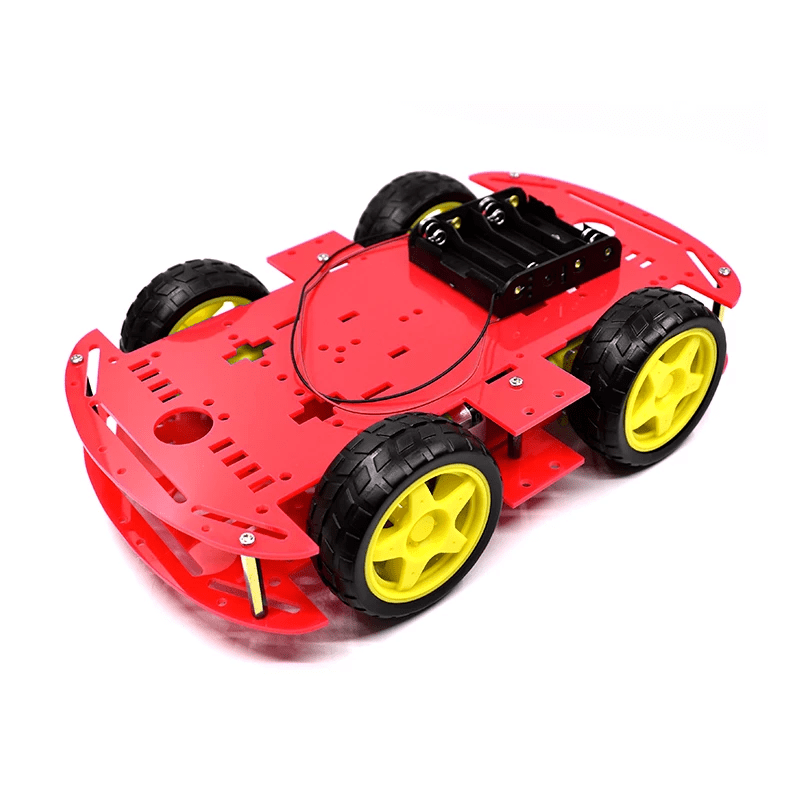

# 4WD acrylic car kit with 3.7V battery

## Part list
- Acrylic car kit (W: 15cm, H: 6cm, L: 25cm) with TT gear motors(3-6V, 90-200rpm)

- 3.7V 18650 batteries
- 18650 battery holder. This chassis can fit 2x batteries between motors or more batteries on the top.
- BMS: 1S-3876 (5A). Battery protection MUST be installed for safety!
- Charger: TP4056 (1A) or IP2312 (3A). Optional, to charge the batteries on-board with a USB cable. In case of TP405, choose the version without integrated BMS or it will constantly turn off the power due to high starting current of the motors!
- Step-UP (boost) converter: SX1308 or MT3608
- Motor driver MX1508, TA6586, DRV8833, L9110S, TB6612 (Connect STBY, PWMA, PWMB to VCC pin) or L298N (low performance)
- 2x 470uF capacitors
- 2x 100nf (0.1uF) capacitor
- 2x Servo: SG90(plastic gear) or MG90(metalic gear)
- [ESP32-CAM by AiThinker](http://www.ai-thinker.com/pro_view-24.html)

## Schematic
TODO: add schematic

## Assembly
To attach a servo use standard servo pan/tilt mount with this [3D printed clip](https://www.thingiverse.com/thing:4934734)  
TODO: add assembly instructions with pictures
