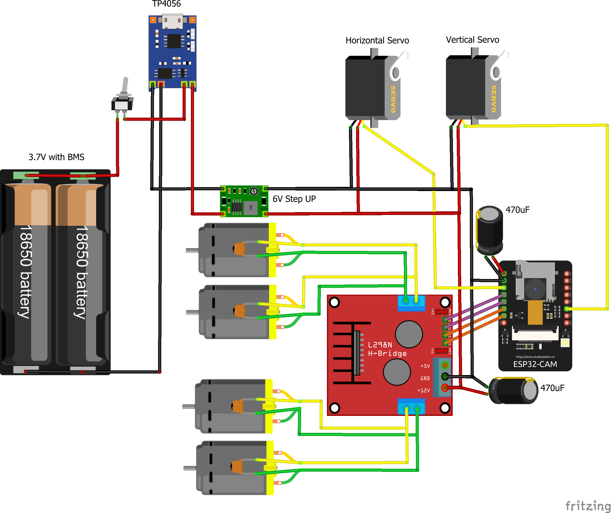

## Building an ESP controlled chassis

### 1. Chassis selection
- Mini TP100 chassis (W: 15cm, H: 6cm, L: 20cm)

- Acrylic car kit (W: 15cm, H: 6cm, L: 25cm)

### 1. Battery selection
- 12V battery. Usually come with a spare charger.
- 18650 in series. Output: 3.7V
- 3x 18650 in paralell. Output 11.1V. Needs special charging/balancing circuit. Not recommended.

When using 18650 batteries in series make sure to connect a BMS circuit and a charging circuit. Following parts are required for a safe 18650 assembly:
- Charger: TP4056 (1A) or IP2312 (3A)
- BMS: 1S-3876 (5A)
- 18650 battery holder
- Switch to power on/off the whole system

**NOTE:** in case of TP405, choose the version without integrated BMS or it will constantly turn off the power due to high starting current of the motors!

**Step up converters (boosters)**

| Model    | Current        | In Voltage   | Out Voltage   | Notes             
|---       |---             |---           |---            |---                        |
| SX1308   | 2A             | 2 - 24V      | 2 - 28V       | Small and powerful        |
| MT3608   | 2A             | 2 - 24V      | 5 - 28V       |                           |

**Step down converters**

| Model    | Current        | In Voltage   | Out Voltage   | Notes                     |
|---       |---             |---           |---            |---                        |
| MP1584EN | 3A             | 4.5 - 28V    | 0.8 - 20V     | Small and powerful        |
| MP2315   | 1.5-2A         | 4.5 - 24V    | 0.8 - 22V     | Tiny and powerful module  |
| LM2596   | 3A             | 4.5 - 40V    | 1.23 - 37V    | Overpowered. Big size.    |

### 2. Motor drivers

| Model  | Current        | Voltage     | Notes                                               |
|---     |---             |---          | ---                                                 |
| L298N  | 1A Max: 2A     | 4 - 50V     | Big voltage drop, high temperature, low efficiency. |
| TA6586 | 5A Max: 7A     | 3 - 14V     | Good specs. Hard do find.                           |
| MX1508 | 1.5A Max: 2.5A | 2 - 9.6V    | Max voltage is 10V!                                 |
| L9110S | 0.8A Max: 1.5A | 2.5 - 12V   | Sometimes they suddenly burn out!                   |
| TB6612 | 1.2A Max: 3A   | 4.5 - 13.5V | Connect STBY, PWMA, PWMB to VCC pin.                |

**NOTE**: It is recommended to put a 100nf (0.1uF) capacitor between the motor contacts to avoid interference.

### 3. Servo motors
The two types of servos are: 
- SG90: micro servo motor with plastic gears
- MG90: micro servo motor with metal gears

Both servos need a 5V power supply. To attach a servo use standard servo pan/tilt mount with this [3D printed clip](https://www.thingiverse.com/thing:4934734)

### 4. Main board
At the moment, the only tested board is [ESP32-CAM by AiThinker](http://www.ai-thinker.com/pro_view-24.html)

## Examples:
### Using 18650 in series and 4 pin motor driver
This is the easiest solution. Because the battery voltage is below 5V we need a 5V step up converter to power the servos, another 5V to power the ESP32-CAM board and one  between 6-12V depending on the selected motor type.

### Using > 5V battery and 4 pin motor driver
Because the voltage is above 5V we need a step down converter to reduce the voltage to 5V and power the servos and the ESP32-CAM board. Depending on the battery voltage and selected motor you will have to choose wheter to step up or down the voltage.

### Using 18650 in series and TB6612 motor driver
Connect STBY, PWMA, PWMB to VCC(5V!) pin When using TB6612 instead of a common 4 pin motor driver.

