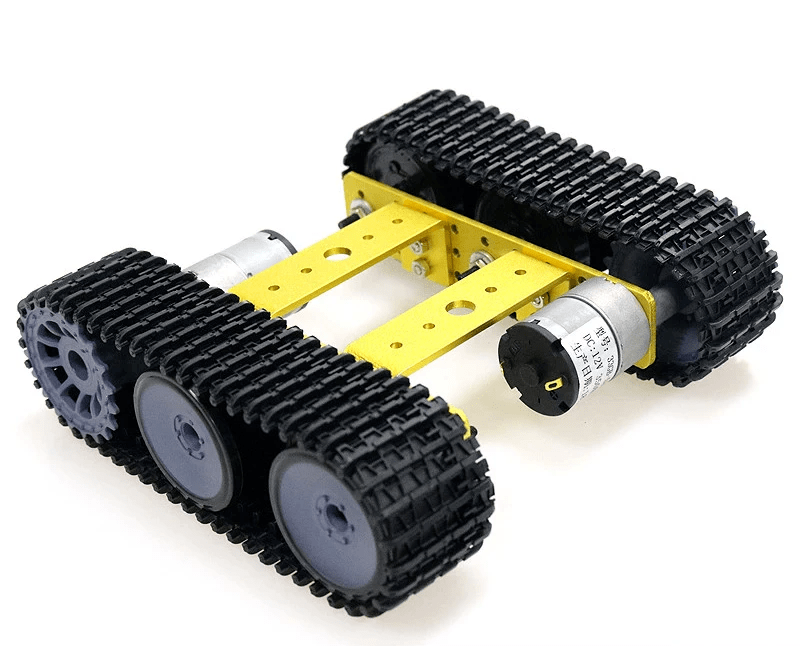

# TP100 with 12V battery

## Part list
- Mini TP100 chassis (W: 15cm, H: 6cm, L: 20cm) with 33GB-520 motors (6-12V, 170-350rpm)

- 12V Lithium battery or 3x 18650 in paralell. 
- Step down converter: MP1584EN, MP2315 or LM2596
- Motor driver: TA6586, L9110S, TB6612 (Connect STBY, PWMA, PWMB to VCC pin) or L298N (low performance)
- 2x 470uF capacitors
- 2x 100nf (0.1uF) capacitor
- 2x Servo: SG90(plastic gear) or MG90(metalic gear)
- [ESP32-CAM by AiThinker](http://www.ai-thinker.com/pro_view-24.html)

## Schematic
